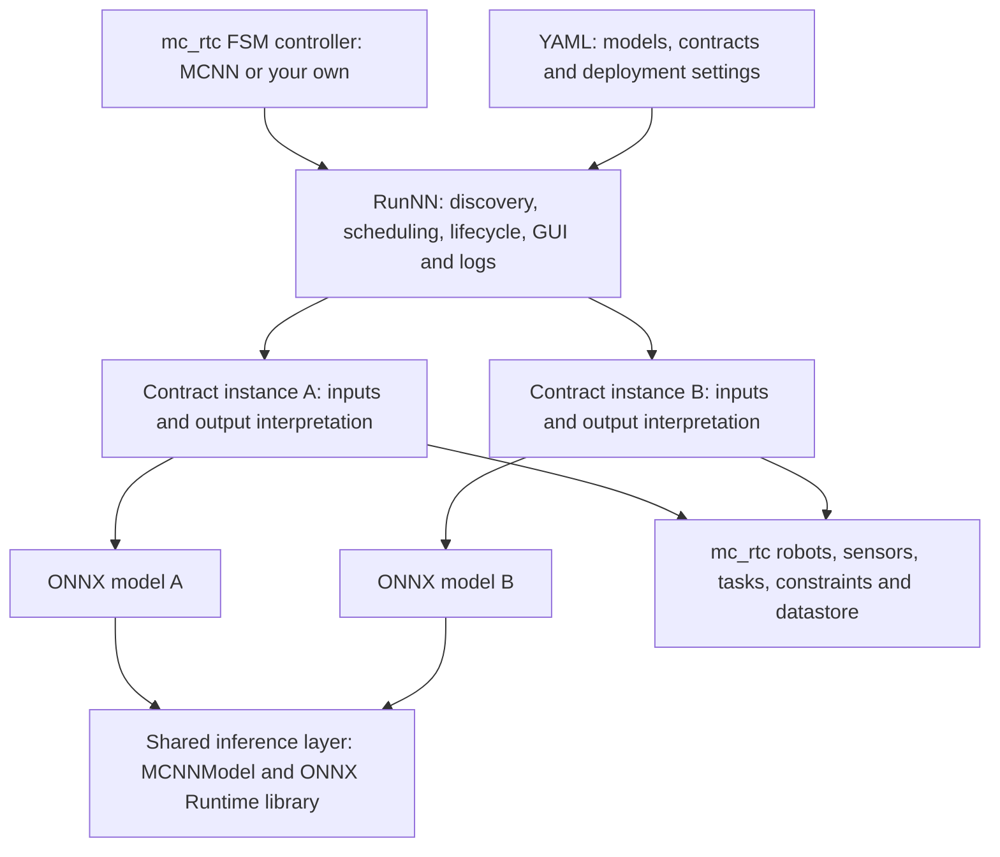
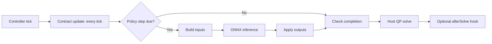
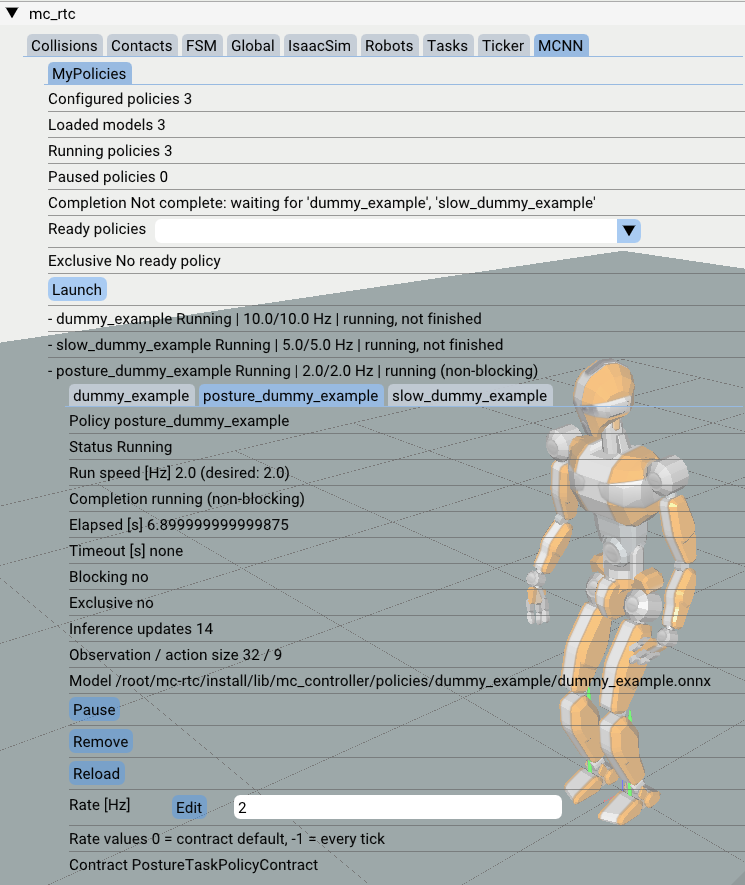

# 🧠 mc_nn — Neural networks as reusable mc_rtc components

**Integrate a policy once. Reuse it across mc_rtc FSM controllers.**

[](https://en.cppreference.com/w/cpp/17)
[](https://onnxruntime.ai/)
[](https://jrl-umi3218.github.io/mc_rtc/)

mc_nn connects ONNX models to [mc_rtc] through small C++ **contracts**: the
interfaces that build a network's inputs and interpret its outputs. Its
`RunNN` FSM state handles discovery, scheduling, lifecycle, GUI and logs, so
you can deploy a different policy without writing another full controller.

> **In a hurry?** Follow the [Quick start](#quick-start). Already have a model?
> See [RunNN configuration](#runnn-configuration). Building a new interface?
> Start with [Write a contract](#write-a-contract).

Use the supplied **MCNN controller** to get started, or load `RunNN` into an
existing FSM controller alongside your other states, tasks and observers.

## Highlights

| | |
| --- | --- |
| **One integration pattern** | The same lifecycle and deployment settings for control, estimation, perception and supervision networks. |
| **Reusable interfaces** | A contract can serve multiple compatible models; each deployment gets its own instance and configuration. |
| **Several policies, one host** | Independent rates, timeouts and completion conditions, with common launch, pause, reload and exclusivity controls. |
| **Modular installation** | Contracts are separate optional libraries, including packages built outside mc_nn. Install only the interfaces and dependencies you need. |
| **Shared inference layer** | Contracts can use the same ONNX Runtime library and `MCNNModel` wrapper instead of maintaining their own inference plumbing. |
| **No universal policy schema** | Joint mappings, observation layouts and action semantics stay in the contract, not in a growing collection of core configuration switches. |

## Contents

| Start and configure | Develop and extend |
| --- | --- |
| [Why mc_nn?](#why-standardize-policy-interfaces) · [How it works](#how-it-works) · [Quick start](#quick-start) | [Write a contract](#write-a-contract) · [Contract API and examples](contracts/README.md) |
| [RunNN configuration](#runnn-configuration) · [Use an existing contract](#reuse-an-existing-contract) · [Use another FSM controller](#use-your-own-fsm-controller) | [Combine networks](#combine-networks) · [Runtime and performance](#runtime-and-performance) · [Package reference](#package-layout-and-reference) |

### Quick links

- [RandomPolicyContract](contracts/RandomPolicyContract/README.md) — safely test model loading and inference.
- [PostureTaskPolicyContract](contracts/PostureTaskPolicyContract/README.md) — tutorial for connecting outputs to an mc_rtc task.
- [Contracts guide](contracts/README.md) — hooks, lifecycle, and creating internal or external contracts.

## Why standardize policy interfaces?

**Add a policy interface (Contract), not another full controller.** `RunNN` handles shared
execution; contracts define each network's inputs, outputs and robot requirements.

- **Less duplicated code:** reuse inference, scheduling, lifecycle, GUI and logs
  across policies and existing FSM controllers.
- **Easier reuse and composition:** install a shared contract, select compatible
  models, and manage several policies with the same controls.
- **Focused dependencies and configuration:** install only the contracts you need;
  policy-specific mappings and options stay out of the core.
- **Independent development:** teams can maintain and share specialized contracts
  without forking mc_nn or changing host controllers for each new policy type.
- **Shared core improvements:** fixes, stronger model checks, ONNX Runtime upgrades
  and future CUDA integration improvements can benefit all compatible contracts
  using `MCNNModel`, instead of being reimplemented in each policy controller.
  CUDA still requires a suitable runtime, dependencies and deployment settings.

The interface is standardized, not the observation or action space: models must
still match their contract's conventions. Your FSM controller remains responsible
for application orchestration.

## How it works

A **policy** in mc_nn is an ONNX model selected with a contract and a
configuration. The term also covers estimators and other non-control networks.



`RunNN` discovers models and creates an independent contract instance for each
configured policy. While a policy is running, its contract can access the host
controller's robots, sensors, solver, tasks, constraints and datastore.



The input/inference/output path above is supplied by the single-model `MCNN`
base class. The lower-level `MCNNContract` lets a contract define its own step,
including running several models. Post-solve hooks require host support.

## Quick start

### 1. Build and install

Requires an installed mc_rtc development environment and a C++17 compiler.
ONNX Runtime 1.25.1 is vendored in this package; no separate ONNX Runtime
installation is needed for the default CPU build.

From the mc_nn source directory:

```bash
cmake -S . -B build -DCMAKE_BUILD_TYPE=RelWithDebInfo
cmake --build build
cmake --install build
```

By default mc_nn installs next to mc_rtc. To install elsewhere, configure with
`-DMC_RTC_HONOR_INSTALL_PREFIX=ON -DCMAKE_INSTALL_PREFIX=<prefix>` and add
`<prefix>/lib/mc_controller` to `ControllerModulePaths` in your mc_rtc
configuration. Installed libraries use RPATH to find mc_nn's dependencies;
`LD_LIBRARY_PATH` is not needed for mc_nn.

### 2. Enable the host controller

Set `Enabled: [MCNN]` in your mc_rtc configuration, keeping your existing robot
and simulator settings. The supplied controller's FSM defaults and solver
`FeedbackType` are defined in [etc/MCNN.in.yaml](etc/MCNN.in.yaml).

### 3. Try the bundled smoke-test model

mc_nn installs a sample model as `dummy_example.onnx` in its default policies
directory. Add this state to `~/.config/mc_rtc/controllers/MCNN/<robot>.yaml`:

```yaml
states:
  TryDummyExample:
    base: RunNNBase
    active_policies: [dummy_example]
    # To smoke-test a different ONNX model, uncomment and set its folder and file name:
    # models_dirs: [/path/to/my_models]
    # active_policies: [my_model]
    policies:
      - onnx: ["dummy_example"] # wildcard patterns are supported if you want several policies to share the same configurations
        # For another model, replace "dummy_example" above with "my_model".
        contract: RandomPolicyContract
        policy_hz: 10.0
        print_every: 10
transitions:
  - [TryDummyExample, OK, TryDummyExample, Strict]
init: TryDummyExample
```

Start the controller with your usual mc_rtc runner. The
[RandomPolicyContract](contracts/RandomPolicyContract/README.md) sends random
inputs to the model and prints its outputs; it does not control the robot.
This is an inference smoke test, not a deployable policy. To run a custom policy
for robot control, use a contract that implements that model's input and output
conventions; see [Reuse an existing contract](#reuse-an-existing-contract).

### 4. Try a posture-task example

This uses the same bundled model but sends its actions to an mc_rtc posture
task. **The observations are random, so this is only a control-pipeline demo,
not a meaningful or safe-to-deploy policy. Try it in simulation first.**
This example keeps the Step 3 random-policy instance active and adds the
posture-task instance. Both use the same model; `prefix` gives the second
instance a distinct policy ID. The bundled ONNX model has 9 actions, so the
contract can control up to 9 one-DoF joints. Replace the example G1 joints with
joints from your robot; fewer joints are allowed, and the contract uses the
first action slots in list order.

```yaml
states:
  TryBothPolicies:
    base: RunNNBase
    active_policies: [dummy_example, posture_dummy_example]
    policies:
      - onnx: ["dummy_example"]
        contract: RandomPolicyContract
        policy_hz: 10.0
        print_every: 10
      - onnx: ["dummy_example"]
        prefix: "posture_" #We need to add a prefix to avoid naming conflict with already configured policy named "dummy_example" fro RandomPolicyContract
        contract: PostureTaskPolicyContract
        policy_hz: 2.0
        joints: [right_wrist_roll_joint, right_wrist_pitch_joint]
        weight: 1.0
        stiffness: 1.0
transitions:
  - [TryBothPolicies, OK, TryBothPolicies, Strict]
init: TryBothPolicies
```

See the [PostureTaskPolicyContract tutorial](contracts/PostureTaskPolicyContract/README.md)
for how to replace random observations with robot, sensor, or object state.

## RunNN configuration

`RunNN` separates **state-wide discovery and UI settings** from **per-policy
scheduling settings**. Every policy entry also has its own contract-specific
settings; those are documented by that contract.

### A minimal state

Derive from `RunNNBase` to search mc_nn's installed `policies/` directory by
default. Use `RunNN` directly when you want to provide every setting yourself.

```yaml
states:
  MyPolicies:
    base: RunNNBase #or RunNN
    active_policies: [walk_v1]
    policies:
      - onnx: ["walk_v1"]
        contract: MyPolicyContract
        policy_hz: 50.0
```

### State-wide settings

| Setting | Type | Default | Purpose |
| --- | --- | --- | --- |
| `models_dirs` | list of strings | Package policies directory | Folders recursively searched for `.onnx` files. With `RunNNBase`, defaults to mc_nn's installed policies. Relative entries are relative to that directory. See [Model discovery and policy IDs](#model-discovery-and-policy-ids). |
| `contracts_dirs` | list of strings | `[]` | Additional directories of contract `.so` libraries. mc_nn's own contract directory is searched automatically. See [Reuse an existing contract](#reuse-an-existing-contract). |
| `preload` | boolean | `false` | Load configured models when the state starts instead of on first launch. See [Runtime and performance](#runtime-and-performance). |
| `verbose` | integer | `1` | Set to `1` for rate warnings, `0` for silence. See [GUI and runtime controls](#gui-and-runtime-controls). |
| `gui`, `logs` | boolean | `true` | Enable or disable RunNN's common GUI and logs; contract-specific hooks are also skipped when disabled. See [GUI and runtime controls](#gui-and-runtime-controls). |
| `active_policies` | list of strings | `[]` | Policy IDs or wildcard patterns to start with the state. See [Model discovery and policy IDs](#model-discovery-and-policy-ids) and [Completion and FSM transitions](#completion-and-fsm-transitions). |
| `policies` | list of mappings | `[]` | Policy entries specifying model patterns, contract names and per-policy options. See [Model discovery and policy IDs](#model-discovery-and-policy-ids) and [Completion and FSM transitions](#completion-and-fsm-transitions). |

### Common policy settings

These fields apply to each `policies` entry, regardless of the selected
contract. Add any additional fields required by that contract.

| Setting | Type | Default | Purpose |
| --- | --- | --- | --- |
| `onnx` | list of strings | Required | Model file names (without `.onnx`) or wildcard patterns. See [Model discovery and policy IDs](#model-discovery-and-policy-ids). |
| `prefix` | string | `""` | Prepended to each matched model name to create its policy ID. See [Model discovery and policy IDs](#model-discovery-and-policy-ids). |
| `contract` | string | Required | Registered C++ contract name that defines inputs and outputs. See [Reuse an existing contract](#reuse-an-existing-contract). |
| `policy_hz` | number | `0.0` | Inference rate in Hz; `0` uses the contract default (30 Hz for the base contract), `-1` runs every controller tick. See [GUI and runtime controls](#gui-and-runtime-controls). |
| `timeout` | number | `0.0` | Maximum duration in seconds; `0` means no timeout. See [Completion and FSM transitions](#completion-and-fsm-transitions). |
| `blocking` | boolean | `true` | Whether the policy must finish or time out before the FSM state completes. See [Completion and FSM transitions](#completion-and-fsm-transitions). |
| `exclusive` | boolean | Contract default (`false` in `MCNNContract`) | Whether launching this policy pauses other running policies. See [Exclusivity and multiple policies](#exclusivity-and-multiple-policies). |
| `device` | string | `"auto"` | Inference device: `cpu`, `cuda` or `auto` (subject to the installed ONNX Runtime build). See [Runtime and performance](#runtime-and-performance). |

### Full multi-policy template

This template includes all state-wide and common policy options and configures
the same model with two random-policy configurations and a posture-task
configuration. `seed`, `input_min`, `input_max`, `print_every`, and
`finish_after` are specific to `RandomPolicyContract`; the posture contract has
its own settings. The ONNX selectors use shell-style wildcards (not regular
expressions): `dummy_*` matches model filenames beginning with `dummy_`.

```yaml
states:
  MyPolicies:
    base: RunNNBase
    # ---------------- State-wide settings
    models_dirs: []       # Empty uses the package default; add folders to search elsewhere
    contracts_dirs: []    # Extra contract-library directories; mc_nn contracts load automatically
    preload: false        # Load models at state start instead of first launch
    verbose: 1            # 1 = rate warnings; 0 = silent
    gui: true             # false also skips contract addGui hooks
    logs: true             # false also skips contract addLog hooks
    active_policies:      # IDs (prefix + model name) or wildcard patterns to start
      - dummy_example
      - slow_dummy_example
      - posture_dummy_example
    policies:             # Each matched model gets its own contract instance
      # Policy ID: dummy_example
      - onnx: ["dummy_example"] # Filename without .onnx; wildcards such as "walk_*" also work
        prefix: ""              # Prefix prepended to each matched model name
        contract: RandomPolicyContract
        policy_hz: 10.0          # 0 = contract default; -1 = every controller tick
        timeout: 0.0             # Seconds; 0 = no timeout
        blocking: true           # Must finish or time out before RunNN completes
        exclusive: false         # If true, pauses other running policies
        device: auto             # cpu, cuda, or auto (depends on ONNX Runtime build)
        # RandomPolicyContract-specific settings:
        seed: 0                   # 0 = new random sequence at each launch
        input_min: -1.0           # Uniform random observation range [input_min, input_max]
        input_max: 1.0
        print_every: 10           # Print action summary every N inference steps
        finish_after: 100         # 0 = never finish; this demo reports completion after 100 steps
      # Same model, separate instance and ID: slow_dummy_example
      - onnx: ["dummy_example"]
        prefix: "slow_"
        contract: RandomPolicyContract
        policy_hz: 5.0            # This instance uses a different inference rate
        timeout: 0.0
        blocking: true
        exclusive: false
        device: auto
        seed: 42                  # Fixed seed for repeatable random inputs
        input_min: -1.0
        input_max: 1.0
        print_every: 10
        finish_after: 100
      # Wildcard selects dummy_example.onnx; prefix gives it a unique policy ID.
      - onnx: ["dummy_*"]       # Shell-style glob: matches dummy_example, not a regular expression
        prefix: "posture_"
        contract: PostureTaskPolicyContract
        policy_hz: 2.0
        timeout: 0.0
        blocking: false           # This tutorial contract does not report finished()
        exclusive: false
        device: auto
        # PostureTaskPolicyContract-specific settings:
        joints: [right_wrist_roll_joint, right_wrist_pitch_joint]
        weight: 1.0
        stiffness: 1.0
        seed: 0
        input_min: -1.0
        input_max: 1.0
transitions:
  # Wait for both blocking random policies to report OK. The non-blocking posture demo does not hold completion.
  - [MyPolicies, "dummy_example(OK), slow_dummy_example(OK)", NextState, Auto]
  # Alternative: set active_policies: [dummy_example] to run/wait for just that policy.
  - [MyPolicies, "dummy_example(OK)", SinglePolicyDone, Auto]
  # Alternative: set a nonzero timeout shorter than completion; if no policy finished, the output is OK.
  - [MyPolicies, OK, TimedOutOrNoPolicyReportedOK, Auto]
init: MyPolicies
```

An empty `models_dirs` uses the package's default policies directory; with
`RunNNBase`, this is mc_nn's installed bundled policies directory. Every
`active_policies` entry must match a configured policy ID. Contract-specific
options vary; consult the selected contract's README for their fields/defaults.
`RunNN` waits for all active **blocking** policies to finish or time out before
emitting its FSM output. A non-blocking policy may continue running while it
waits for the blocking policies. Transition strings are exact: the combined
output example matches only when both named policies report `OK` in the same
completion output.

### Model discovery and policy IDs

- Every `models_dirs` entry is searched recursively; models can live anywhere.
- A pattern without `/` matches the file name (`walk_*`, `*`); a pattern with
  `/` matches the relative path under its `models_dirs` entry
  (`2026-*/walk_*`).
- All models matched by one entry share its contract and configuration, but
  each receives an independent contract instance.
- A policy ID is `prefix` + the model file name. Use it in
  `active_policies`, GUI controls and FSM outputs.

If two entries use the same model, give them different prefixes:

```yaml
- onnx: ["walk_v1"]
  contract: MyPolicyContract
  prefix: ""
- onnx: ["walk_v1"]
  contract: MyPolicyContract
  prefix: "slow_"
  policy_hz: 25.0
```

RunNN reports an error if a pattern matches no models, a selected model name is
ambiguous across directories, or two entries create the same policy ID.

### GUI and runtime controls

The GUI is in a tab called `MCNN`. A configured policy moves through these
states:

| GUI state | Meaning |
| --- | --- |
| **Ready** | Configured and available to launch. Unless `preload: true`, its model and contract are loaded when it is launched. |
| **Running** | Started and updated by `RunNN` on controller ticks, with inference at its configured rate. |
| **Paused** | Still in the running list, but torn down and no longer updated. Playing it starts it again from scratch. |

The `Ready policies` dropdown contains policies not currently in the running
list. Launching one moves it to that list. The running and paused counts, plus
each policy's completion status, are shown in the `MCNN` tab. `active_policies`
is separate from these GUI states: it selects which configured policy IDs
`RunNN` should launch automatically when the state starts.

<!-- Screenshot placeholder for the Full multi-policy template:
     Save the screenshot as docs/images/run_nn_multi_policy_gui.png, then
     uncomment the image line below.

-->

In the [Full multi-policy template](#full-multi-policy-template), the
`dummy_example`, `slow_dummy_example` and `posture_dummy_example` entries are
configured policies. The two random-policy entries are blocking; the posture
example is non-blocking, so it can keep running while `RunNN` waits for the
blocking policies. Use the ready dropdown to launch policies manually, or
`active_policies` to start selected IDs automatically.

| Control | Effect |
| --- | --- |
| **Launch** | Start a ready policy selected in the dropdown. |
| **Pause** | Tear down a running policy but keep it in the running list as paused. |
| **Play** | Start a paused policy again from scratch. |
| **Remove** | Remove it from the running list and return it to Ready; its loaded model and contract instance are retained. |
| **Reload** | Recreate the contract instance and reload its model and contract files; restart it if it was running. |
| **Rate** | Change the inference rate while running. |

With `gui: false`, the GUI is not created and contract `addGui` hooks are not
called. Policies configured in `active_policies` still run.

### Exclusivity and multiple policies

An exclusive policy pauses all other running policies when launched. Launching
another policy pauses the exclusive one; previously paused policies do not
resume automatically. `active_policies` cannot start an exclusive policy
alongside other policies. YAML `exclusive` overrides the contract's default.

Several policies can run in one `RunNN` state, each with its own model,
contract, rate, timeout and completion condition. They execute sequentially in
running-list order, **not as parallel inference workers**. Separate solver
tasks from different contracts remain in the QP together; use appropriate
weights, active joints or task dimensions, or make a policy exclusive.

### Completion and FSM transitions

`RunNN` follows the usual mc_rtc FSM state pipeline: its `run()` method returns
`false` while the state is still running; once complete, it sets the state's
output and returns `true`. The FSM then uses that output to select a configured
transition, as described in the
[mc_rtc FSM facilities tutorial](https://jrl-umi3218.github.io/mc_rtc/tutorials/recipes/fsm.html).

Completion has two separate parts: **the completion gate** determines when the
FSM state may return, and **the output string** determines which transition
matches.

1. On each controller tick, `RunNN` updates every running policy, calls its
   `step()` when its inference schedule is due, then checks `finished()`.
   Inference therefore runs sequentially, at each policy's configured rate.
2. `RunNN` returns complete only when at least one policy is in its running
   list, no blocking policy is paused, and every running blocking policy has
   either returned `finished() == true` or timed out. Non-blocking policies do
   not hold this gate. The GUI shows why the state is still waiting.
3. Once the gate passes, the FSM output is the comma-separated IDs of the
   running policies whose `finished()` is true on that tick, in running-list
   order. Timed-out policies are omitted. If no policy reports finished, the
   output is plain `OK`.
4. mc_rtc matches transitions by **exact output string**, not by regular
   expression. A transition is evaluated when `RunNN` returns complete.

So **if all policies return `finished() == true`, the output is not plain
`OK`**; it contains every finished policy ID, such as
`policy_a(OK), policy_b(OK)`. Plain `OK` means no running policy reported
finished (for example, a blocking policy completed only by timing out).

```yaml
transitions:
  # Both policies finished by the time the completion gate opens.
  - [MyPolicies, "policy_a(OK), policy_b(OK)", BothFinished, Auto]
  # policy_a finished; policy_b timed out before finishing, so only A is in the output.
  - [MyPolicies, "policy_a(OK)", PolicyADone, Auto]
  # The completion gate opened (e.g. by timeout), but no policy reported finished.
  - [MyPolicies, OK, TimedOutWithoutFinishedPolicy, Auto]
  # Optional catch-all for any exact output string not listed above.
  - [MyPolicies, DEFAULT, UnexpectedOutput, Auto]
  # An active policy failed to load.
  - [MyPolicies, SKIP, RecoveryState, Auto]
```

For the **single-policy** case, set `active_policies: [policy_a]` and match
`"policy_a(OK)"`. For **one required policy plus background work**, configure
`policy_a` as blocking and `policy_b` as non-blocking. If `policy_b` remains
unfinished, the output is `"policy_a(OK)"`; if it also reports finished before
the completion gate opens, the output includes both IDs. To wait for **all**
blocking policies to finish successfully, match the combined output containing
all their IDs. If a blocking policy times out, it does not produce `id(OK)`;
the output contains IDs for other policies that finished, or is plain `OK` if
none did.

Transitions are exact matches. `DEFAULT` can be used as mc_rtc's fallback
transition for any otherwise-unlisted output. `OK` does **not** mean every
policy finished successfully: if all running policies report finished, match
their combined ID string. `RunNN` returns `SKIP` if a model listed in
`active_policies` fails to load. A contract whose default completion hook
always returns false needs a non-zero timeout if it should eventually satisfy
the completion gate.

## Reuse an existing contract

You do not need to modify mc_nn or create a new controller to use someone
else's interface:

1. Build and install mc_nn, then the external contract against that installation.
2. Obtain a model compatible with that contract, including any required side files.
3. Point `RunNN` to the contract libraries and models, and select the contract's registered name.
4. Supply its deployment settings and check its robot and host requirements.

For an external package registering `MyPolicyContract`, the state settings are:

```yaml
contracts_dirs: ["<contract install prefix>/lib/mc_nn_contracts"]
models_dirs: ["/path/to/models"]
active_policies: [my_model]
policies:
  - onnx: ["my_model"]
    contract: MyPolicyContract
    policy_hz: 50.0
```

The default contract directory is discovered automatically; `contracts_dirs`
adds external directories. Contracts built outside mc_nn use
`find_package(mc_nn)` and link to its installed core. Rebuild them when mc_nn
changes. See [External contracts](contracts/README.md#external-contracts) for
the CMake setup.

**Install the interfaces you need.** Each contract is its own optional shared
library. Disable a bundled contract with `-DMC_NN_CONTRACT_<Name>=OFF`.
CMake reports enabled, disabled and skipped contracts; declared missing header
or contract dependencies can cause a contract to be skipped rather than break
the core build. External packages can supply their own specialized dependencies
without adding them to every mc_nn deployment.

## Combine networks

mc_nn is not limited to networks that command joints. Contracts can implement:

| Role | Examples |
| --- | --- |
| **Control** | RL or imitation policies driving tasks, joint targets or torques through the QP |
| **Estimate** | Contact, force, object pose, slippage or terrain estimates |
| **Perceive and predict** | Goals, classifications or anomaly signals derived from sensor data |
| **Adapt and supervise** | Gain tuning, task weights, behavior selection or execution monitoring |

Use several policy entries and `active_policies` to run compatible networks
side by side, each at its own rate. Contracts can exchange values through the
datastore, for example an estimator feeding a control policy. They must define
the shared keys, update ordering and how stale data is handled themselves.

There are two distinct composition levels:

- **Several policies in `RunNN`**: independent instances, configurations, rates,
  timeouts and completion conditions, with shared operator controls.
- **Several models inside one contract**: use `MCNNContract` to coordinate a
  tightly coupled pipeline and manage its models and internal state yourself.

The common GUI supports launch, pause/play, remove, reload and rate changes.
An exclusive policy pauses other running policies when launched. Ordinary FSM
transitions can sequence networks, and FSM parallel states can combine
`RunNN` with other controller behavior.

> Running several policies does not automatically resolve resource conflicts.
> Separate tasks remain in the QP together; choose appropriate weights, joints
> and task dimensions, or make a policy exclusive. Policies execute sequentially
> in running-list order, not as parallel inference workers.

See [Exclusivity and multiple policies](#exclusivity-and-multiple-policies)
and [Completion and FSM transitions](#completion-and-fsm-transitions) above
for the exact behavior.

## Use your own FSM controller

When mc_nn is installed alongside mc_rtc, use these paths in your controller's
CMake-configured FSM YAML template:

```yaml
StatesLibraries:
  - "@MC_STATES_DEFAULT_RUNTIME_INSTALL_PREFIX@"
  - "@MC_STATES_RUNTIME_INSTALL_PREFIX@"
  - "@MC_STATES_DEFAULT_RUNTIME_INSTALL_PREFIX@/../../MCNN/states"
StatesFiles:
  - "@MC_STATES_DEFAULT_RUNTIME_INSTALL_PREFIX@/data"
  - "@MC_STATES_RUNTIME_INSTALL_PREFIX@/data"
  - "@MC_STATES_DEFAULT_RUNTIME_INSTALL_PREFIX@/../../MCNN/states/data"
```

For a custom mc_nn installation, replace the two MCNN entries with
`<mc_nn install prefix>/lib/mc_controller/MCNN/states` and its `/data` directory.

Then define states with `base: RunNN` or `base: RunNNBase`. `RunNNBase` sets
`models_dirs` to the installed bundled policies by default.

Contracts requiring post-solve work also need the host to declare support and
call `"MCNN::AfterSolve"` after the QP solve. Contracts may check the host's
solver feedback type. The supplied MCNN controller implements these hooks;
see [Host controller requirements](contracts/README.md#host-controller-requirements)
for integration into another controller.

## Write a contract

Start from [RandomPolicyContract](contracts/RandomPolicyContract/README.md),
then choose the base matching your interface:

| Base | Use when | You provide |
| --- | --- | --- |
| `MCNN` | One model with an input/inference/output step | Configuration, startup validation, inputs, output application and cleanup |
| `MCNNContract` | Several models or a custom execution path | Model ownership and the hooks your interface needs, including per-tick or post-solve work |

Keep observation ordering, normalization, joint mapping and action semantics
in the contract or its model side files. Keep deployment tuning such as rate,
timeout, gains and targets in YAML. Register the contract by name and build it
as a separate library with `mc_nn_add_contract()`; no core changes are needed
for external contracts.

For a torque-control example with safety constraints enforced by a CBF-QP, see
[mc_nn_SafeCBFTorquePolicyContract](https://github.com/isri-aist/mc_nn_SafeCBFTorquePolicyContract).
Those safety mechanisms belong to that contract, not to mc_nn itself.

## Runtime and performance

**One shared runtime library, not one shared session.** The core links to the
vendored ONNX Runtime library, and external contracts built against mc_nn reuse
that dependency. Each `MCNNModel` owns a separate ONNX environment and session;
the single-model `MCNN` helper creates one model per policy instance. mc_nn
does not automatically pool sessions, deduplicate model weights or batch
inference across policies.

Inference is synchronous in the controller loop. Independent rates avoid
stepping every network on every tick, but the combined cost of all steps due
on a tick must fit the controller's time budget, together with the QP and other
work. Scheduling several networks is not a guarantee of higher throughput or
hard real-time execution. Check achieved rates in the GUI and logs; `RunNN`
warns when a policy cannot keep up.

`MCNNModel` enables extended graph optimizations and uses one intra-op thread.
The bundled ONNX Runtime 1.25.1 is a **CPU build**. The wrapper supports `cpu`,
`cuda` and `auto`, but CUDA requires a runtime build with the CUDA provider and
its dependencies. `cuda` fails if unavailable; `auto` falls back to CPU.

The wrapper validates model shapes and performs a zero-input inference at
load time. It currently supports one float input and selects the output named
`actions`, or the sole output. See [ONNX model requirements](contracts/README.md#onnx-model-requirements)
for supported shapes; input sizes alone cannot validate observation semantics.

## Package layout and reference

| Location | Contents |
| --- | --- |
| [src/mc_nn/](src/mc_nn/) | `libMCNN.so`: contract bases, model wrapper, registry and host hooks |
| [src/states/](src/states/) | `RunNN` FSM state and `RunNNBase` configuration |
| [src/onnxruntime/](src/onnxruntime/) | Vendored ONNX Runtime library and headers |
| [contracts/](contracts/) | Optional contract libraries and the integration guide |
| [policies/](policies/) | Bundled ONNX models and YAML side files; external models can live anywhere |
| [cmake/](cmake/) | Exported `mc_nn` CMake package and `mc_nn_add_contract()` |
| [etc/MCNN.in.yaml](etc/MCNN.in.yaml) | Supplied MCNN controller configuration |

The [contracts guide](contracts/README.md) covers the contract
[lifecycle](contracts/README.md#lifecycle), [hooks](contracts/README.md#hooks-reference),
model access and contract development. Common policy YAML, discovery, GUI and
FSM completion settings are documented in [RunNN configuration](#runnn-configuration).

[mc_rtc]: https://jrl-umi3218.github.io/mc_rtc/
