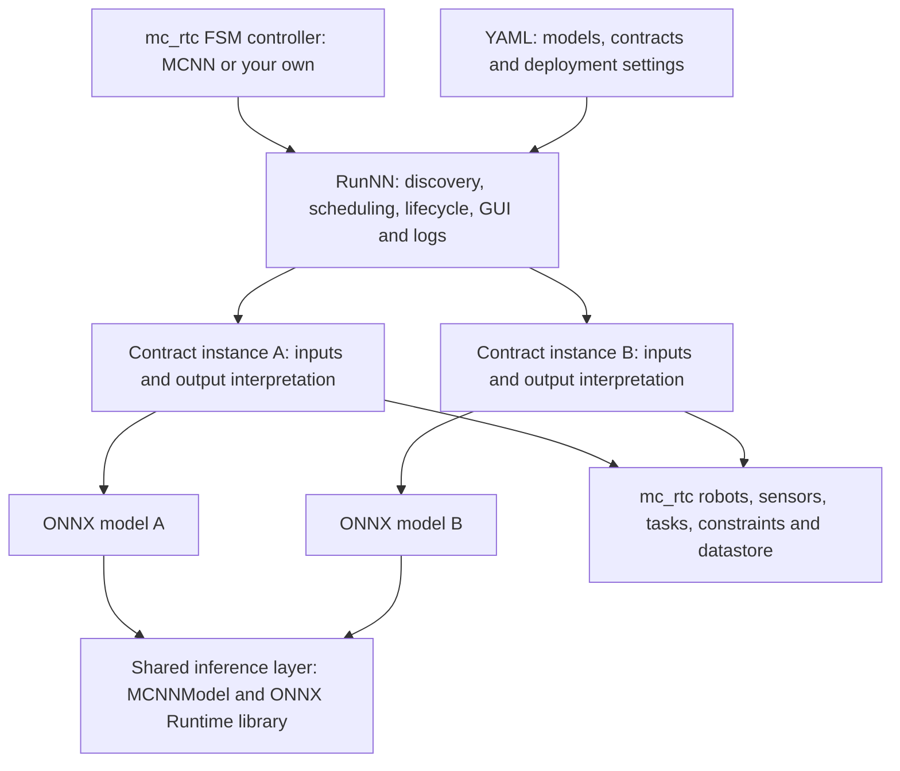
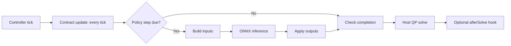

# mc_nn - Neural networks as reusable mc_rtc components

**Integrate a policy once. Reuse it across mc_rtc FSM controllers.**

mc_nn connects ONNX models to [mc_rtc] through small C++ **contracts**: the
interfaces that build a network's inputs and interpret its outputs. Its
`RunNN` FSM state handles discovery, scheduling, lifecycle, GUI and logs, so
you can deploy a different policy without writing another full controller.

See the [contracts guide](contracts/README.md) for what a contract is and how
to use or write one.

Use the supplied **MCNN controller** to get started, or load `RunNN` into an
existing FSM controller alongside your other states, tasks and observers.

## Highlights

| | |
| --- | --- |
| **One integration pattern** | The same lifecycle and deployment settings for control, estimation, perception and supervision networks. |
| **Reusable interfaces** | A contract can serve multiple compatible models; each deployment gets its own instance and configuration. |
| **Several policies, one host** | Independent rates, timeouts and completion conditions, with common launch, pause, reload and exclusivity controls. |
| **Modular installation** | Contracts are separate optional libraries, including packages built outside mc_nn. Install only the interfaces and dependencies you need. |
| **Shared inference layer** | Contracts can use the same ONNX Runtime library and `MCNNModel` wrapper instead of maintaining their own inference plumbing. |
| **No universal policy schema** | Joint mappings, observation layouts and action semantics stay in the contract, not in a growing collection of core configuration switches. |

## Contents

- [Why standardize policy interfaces?](#why-standardize-policy-interfaces)
- [How it works](#how-it-works)
- [Quick start](#quick-start)
- [Reuse an existing contract](#reuse-an-existing-contract)
- [Combine networks](#combine-networks)
- [Use your own FSM controller](#use-your-own-fsm-controller)
- [Write a contract](#write-a-contract)
- [Runtime and performance](#runtime-and-performance)
- [Package layout and reference](#package-layout-and-reference)

## Why standardize policy interfaces?

**Add a policy interface (Contract), not another full controller.** `RunNN` handles shared
execution; contracts define each network's inputs, outputs and robot requirements.

- **Less duplicated code:** reuse inference, scheduling, lifecycle, GUI and logs
  across policies and existing FSM controllers.
- **Easier reuse and composition:** install a shared contract, select compatible
  models, and manage several policies with the same controls.
- **Focused dependencies and configuration:** install only the contracts you need;
  policy-specific mappings and options stay out of the core.
- **Independent development:** teams can maintain and share specialized contracts
  without forking mc_nn or changing host controllers for each new policy type.
- **Shared core improvements:** fixes, stronger model checks, ONNX Runtime upgrades
  and future CUDA integration improvements can benefit all compatible contracts
  using `MCNNModel`, instead of being reimplemented in each policy controller.
  CUDA still requires a suitable runtime, dependencies and deployment settings.

The interface is standardized, not the observation or action space: models must
still match their contract's conventions. Your FSM controller remains responsible
for application orchestration.

## How it works

A **policy** in mc_nn is an ONNX model selected with a contract and a
configuration. The term also covers estimators and other non-control networks.



`RunNN` discovers models and creates an independent contract instance for each
configured policy. While a policy is running, its contract can access the host
controller's robots, sensors, solver, tasks, constraints and datastore.



The input/inference/output path above is supplied by the single-model `MCNN`
base class. The lower-level `MCNNContract` lets a contract define its own step,
including running several models. Post-solve hooks require host support.

## Quick start

### 1. Build and install

Requires an installed mc_rtc development environment and a C++17 compiler.
ONNX Runtime 1.25.1 is vendored in this package; no separate ONNX Runtime
installation is needed for the default CPU build.

From the mc_nn source directory:

```bash
cmake -S . -B build -DCMAKE_BUILD_TYPE=RelWithDebInfo
cmake --build build
cmake --install build
```

By default mc_nn installs next to mc_rtc. To install elsewhere, configure with
`-DMC_RTC_HONOR_INSTALL_PREFIX=ON -DCMAKE_INSTALL_PREFIX=<prefix>` and add
`<prefix>/lib/mc_controller` to `ControllerModulePaths` in your mc_rtc
configuration. Installed libraries use RPATH to find mc_nn's dependencies;
`LD_LIBRARY_PATH` is not needed for mc_nn.

### 2. Enable the host controller

Set `Enabled: [MCNN]` in your mc_rtc configuration, keeping your existing robot
and simulator settings. The supplied controller's FSM defaults and solver
`FeedbackType` are defined in [etc/MCNN.in.yaml](etc/MCNN.in.yaml).

### 3. Try a model

Place `my_model.onnx` in `/home/me/my_models`, then add this state to
`~/.config/mc_rtc/controllers/MCNN/<robot>.yaml`:

```yaml
states:
  TryMyModel:
    base: RunNNBase
    models_dirs: [/home/me/my_models]
    active_policies: [my_model]
    policies:
      - onnx: ["my_model"]
        contract: RandomPolicyContract
        policy_hz: 10.0
transitions:
  - [TryMyModel, OK, TryMyModel, Strict]
init: TryMyModel
```

Start the controller with your usual mc_rtc runner. The
[RandomPolicyContract](contracts/RandomPolicyContract/README.md) sends random
inputs to the model and prints its outputs: this is an inference smoke test,
**not a robot-control policy**. For deployment, select a contract implementing
the model's actual input and output conventions. An example is [SafeCBFTorquePolicyContract](https://github.com/Noceo200/SafeCBFTorquePolicyContract).

## Reuse an existing contract

You do not need to modify mc_nn or create a new controller to use someone
else's interface:

1. Build and install mc_nn, then the external contract against that installation.
2. Obtain a model compatible with that contract, including any required side files.
3. Point `RunNN` to the contract libraries and models, and select the contract's registered name.
4. Supply its deployment settings and check its robot and host requirements.

For an external package registering `MyPolicyContract`, the state settings are:

```yaml
contracts_dirs: ["<contract install prefix>/lib/mc_nn_contracts"]
models_dirs: ["/path/to/models"]
active_policies: [my_model]
policies:
  - onnx: ["my_model"]
    contract: MyPolicyContract
    policy_hz: 50.0
```

The default contract directory is discovered automatically; `contracts_dirs`
adds external directories. Contracts built outside mc_nn use
`find_package(mc_nn)` and link to its installed core. Rebuild them when mc_nn
changes. See [External contracts](contracts/README.md#external-contracts) for
the CMake setup.

**Install the interfaces you need.** Each contract is its own optional shared
library. Disable a bundled contract with `-DMC_NN_CONTRACT_<Name>=OFF`.
CMake reports enabled, disabled and skipped contracts; declared missing header
or contract dependencies can cause a contract to be skipped rather than break
the core build. External packages can supply their own specialized dependencies
without adding them to every mc_nn deployment.

## Combine networks

mc_nn is not limited to networks that command joints. Contracts can implement:

| Role | Examples |
| --- | --- |
| **Control** | RL or imitation policies driving tasks, joint targets or torques through the QP |
| **Estimate** | Contact, force, object pose, slippage or terrain estimates |
| **Perceive and predict** | Goals, classifications or anomaly signals derived from sensor data |
| **Adapt and supervise** | Gain tuning, task weights, behavior selection or execution monitoring |

Use several policy entries and `active_policies` to run compatible networks
side by side, each at its own rate. Contracts can exchange values through the
datastore, for example an estimator feeding a control policy. They must define
the shared keys, update ordering and how stale data is handled themselves.

There are two distinct composition levels:

- **Several policies in `RunNN`**: independent instances, configurations, rates,
  timeouts and completion conditions, with shared operator controls.
- **Several models inside one contract**: use `MCNNContract` to coordinate a
  tightly coupled pipeline and manage its models and internal state yourself.

The common GUI supports launch, pause/play, remove, reload and rate changes.
An exclusive policy pauses other running policies when launched. Ordinary FSM
transitions can sequence networks, and FSM parallel states can combine
`RunNN` with other controller behavior.

> Running several policies does not automatically resolve resource conflicts.
> Separate tasks remain in the QP together; choose appropriate weights, joints
> and task dimensions, or make a policy exclusive. Policies execute sequentially
> in running-list order, not as parallel inference workers.

See [Multiple policies](contracts/README.md#multiple-policies),
[Exclusivity](contracts/README.md#exclusive-policies) and
[Completion and FSM outputs](contracts/README.md#completion-fsm-outputs-and-transitions)
for the exact behavior.

## Use your own FSM controller

Add mc_nn's installed states to your controller's FSM configuration:

```yaml
StatesLibraries:
  - "<mc_nn install prefix>/lib/mc_controller/MCNN/states"
StatesFiles:
  - "<mc_nn install prefix>/lib/mc_controller/MCNN/states/data"
```

Then define states with `base: RunNN` or `base: RunNNBase`. `RunNNBase` sets
`models_dirs` to the installed bundled policies by default.

Contracts requiring post-solve work also need the host to declare support and
call `"MCNN::AfterSolve"` after the QP solve. Contracts may check the host's
solver feedback type. The supplied MCNN controller implements these hooks;
see [Host controller requirements](contracts/README.md#host-controller-requirements)
for integration into another controller.

## Write a contract

Start from [RandomPolicyContract](contracts/RandomPolicyContract/README.md),
then choose the base matching your interface:

| Base | Use when | You provide |
| --- | --- | --- |
| `MCNN` | One model with an input/inference/output step | Configuration, startup validation, inputs, output application and cleanup |
| `MCNNContract` | Several models or a custom execution path | Model ownership and the hooks your interface needs, including per-tick or post-solve work |

Keep observation ordering, normalization, joint mapping and action semantics
in the contract or its model side files. Keep deployment tuning such as rate,
timeout, gains and targets in YAML. Register the contract by name and build it
as a separate library with `mc_nn_add_contract()`; no core changes are needed
for external contracts.

For a torque-control example with safety constraints enforced by a CBF-QP, see
[SafeCBFTorquePolicyContract](https://github.com/Noceo200/SafeCBFTorquePolicyContract).
Those safety mechanisms belong to that contract, not to mc_nn itself.

## Runtime and performance

**One shared runtime library, not one shared session.** The core links to the
vendored ONNX Runtime library, and external contracts built against mc_nn reuse
that dependency. Each `MCNNModel` owns a separate ONNX environment and session;
the single-model `MCNN` helper creates one model per policy instance. mc_nn
does not automatically pool sessions, deduplicate model weights or batch
inference across policies.

Inference is synchronous in the controller loop. Independent rates avoid
stepping every network on every tick, but the combined cost of all steps due
on a tick must fit the controller's time budget, together with the QP and other
work. Scheduling several networks is not a guarantee of higher throughput or
hard real-time execution. Check achieved rates in the GUI and logs; `RunNN`
warns when a policy cannot keep up.

`MCNNModel` enables extended graph optimizations and uses one intra-op thread.
The bundled ONNX Runtime 1.25.1 is a **CPU build**. The wrapper supports `cpu`,
`cuda` and `auto`, but CUDA requires a runtime build with the CUDA provider and
its dependencies. `cuda` fails if unavailable; `auto` falls back to CPU.

The wrapper validates model shapes and performs a zero-input inference at
load time. It currently supports one float input and selects the output named
`actions`, or the sole output. See [ONNX models](contracts/README.md#onnx-models)
for supported shapes; input sizes alone cannot validate observation semantics.

## Package layout and reference

| Location | Contents |
| --- | --- |
| [src/mc_nn/](src/mc_nn/) | `libMCNN.so`: contract bases, model wrapper, registry and host hooks |
| [src/states/](src/states/) | `RunNN` FSM state and `RunNNBase` configuration |
| [src/onnxruntime/](src/onnxruntime/) | Vendored ONNX Runtime library and headers |
| [contracts/](contracts/) | Optional contract libraries and the integration guide |
| [policies/](policies/) | Bundled ONNX models and YAML side files; external models can live anywhere |
| [cmake/](cmake/) | Exported `mc_nn` CMake package and `mc_nn_add_contract()` |
| [etc/MCNN.in.yaml](etc/MCNN.in.yaml) | Supplied MCNN controller configuration |

The [contracts guide](contracts/README.md) is the detailed reference for
[hooks](contracts/README.md#hooks-reference),
[YAML settings](contracts/README.md#yaml-configuration),
[GUI controls](contracts/README.md#gui), lifecycle, completion and contract
development.

[mc_rtc]: https://jrl-umi3218.github.io/mc_rtc/
